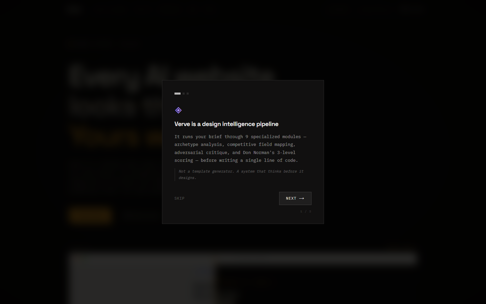

# Verve — Every AI website looks the same. Yours won't.

> **Status:** In active development. APIs, module boundaries and documentation may change before the first stable release.

[](LICENSE)
[](https://nextjs.org)
[](https://typescriptlang.org)
[](https://anthropic.com)
[](https://openai.com)
[](https://ai.google.dev)

> **Verve** is an open-source design intelligence pipeline that sits between any LLM and its code output — forcing bold, non-generic, context-specific UI through 9 specialized modules instead of producing the median AI aesthetic.

[**Development preview →**](https://verve-dev.vercel.app/) · [Prompt Engineering Lab →](/lab) · [Docs →](/docs)

---

## The problem

AI-generated interfaces converge on the same visual defaults:

| What every model produces | Why |
|---|---|
| Inter or Roboto, 700 weight | Most common font in training data |
| Blue-to-purple hero gradients | A high-frequency SaaS visual default |
| `rgba(0,0,0,0.08)` soft shadow cards | Default box-shadow in every CSS framework |
| "Build faster. Boost productivity." copy | Highest-frequency hero copy pattern |
| 4-card feature grid | Most common layout after hero |

This isn't a prompting skill issue. It's a **statistical regression-to-the-mean problem**. Every model, trained on the same corpus, learns the average. The average is indistinguishable.

Verve interrupts that convergence **mechanically** — through a structured 9-stage pipeline, not by asking the model to "be more creative."

---

## How it works — 9 Pipeline Modules

```
User brief (+ optional existing code)
        ↓
[01] BRIEF ANALYZER        → subject, audience, primaryJob (JTBD), tone, industry
        ↓
[02] ASSETS + BLOCKLIST + COMPETITIVE FIELD (parallel)
     • Cliché Blocklist    → 21 curated pattern families / 67 concrete signals
     • Asset Sourcer       → Pexels photos (12-item cliché image blocklist), Fontshare fonts, Lucide icons
     • Competitive Field   → 21-industry dataset of dominant visual patterns — injected as negative constraints
        ↓
[02.5] BRAND ARCHETYPE     → Resolves primary + secondary Jungian archetype from 12 profiles
       (Module I)            Maps to design tokens: color personality, typography, animation easing
                             Identifies archetypeConflict — what to avoid
        ↓
[02.6] ANIMATION LANGUAGE  → Derives CSS animation tokens from archetype: easing curves, @keyframes,
       (Module K)            duration scale, temporal character — injected into both plan + code
        ↓
[03] DESIGN PLAN           → colorPalette (subject-derived, not trend-chasing)
     + COGNITIVE MODULE       typePairing (with optical size system + rationale)
     (Module G)               layoutConcept (narrative, not 4-card grid)
                             signatureElement (required, uniquely justified, non-empty)
                             5 cognitive layers: Von Restorff, Gutenberg, Signal-Noise,
                             Peak-End Rule, Aesthetic-Usability Effect
        ↓
[03] ADVERSARIAL CRITIQUE  → 3-part parallel evaluation inside the plan loop:
                             DesignCritic: "Would a generic prompt produce this?"
                             EndingCheck: Peak-End Rule — is the closing section filler?
                             UsabilityFloor: contrast ratio, touch targets, body text minimum
                             Rejects + regenerates if flagged. Max 2 revision cycles.
        ↓
[04] CONTRAST ENFORCEMENT  → Deterministic WCAG pair checks and stable palette correction
        ↓
[05] CODE GENERATION       → Full component code (Next.js 16 | React 19 | HTML+CSS)
                             Animation tokens injected as CSS custom properties
                             Signature element implemented exactly as specified in plan
        ↓
[05.5] CODE QUALITY LOOP   → Strips fences, parses TSX with TypeScript, checks structure,
                             verifies the signature element, and performs one repair pass
        ↓
[06] DUAL SCORE            → Don Norman's 3-Level evaluation plus engineering quality:
     (Module J)              Visceral (35%) — first impression, visual boldness
                             Behavioral (40%) — usability, evaluated BLIND to aesthetics
                             Reflective (25%) — shareability, archetype coherence
                             Composite 0-100 score, grade S/A/B/C/D
```

---

## Key Design Decisions

### Why the Behavioral score is evaluated "blind"
The [Aesthetic-Usability Effect](https://lawsofux.com/aesthetic-usability-effect/) causes evaluators to rate usable-but-ugly interfaces as harder to use, and beautiful-but-broken interfaces as easier. Module J explicitly separates aesthetic and functional evaluation to prevent this bias from inflating usability scores.

### Why Brand Archetypes, not just "tone"
Tone descriptors ("professional", "modern", "clean") are ambiguous and produce the same middle-ground output. A Jungian archetype carries specific **design prohibitions** — a Ruler archetype prohibits rounded corners, playful typography, and warm palettes; a Jester prohibits rigid grids and serious color values. The prohibition set is what prevents convergence.

### Why Competitive Field analysis
The pipeline doesn't just avoid generic design — it avoids **industry-specific generic design**. Every interior design firm uses the same warm neutrals and serif typography. Every SaaS uses the same blue-tinted dashboard screenshots. Module L identifies these patterns per industry and injects them as explicit "AVOID" constraints.

### Why the critique loop, not just a better prompt
A single prompt asking the model to "be distinctive" doesn't work because the model doesn't have a principled definition of distinctiveness. The critique loop provides one: an isolated LLM call with a specific rubric, blind to the original prompt, evaluating only the plan's outputs.

---

## Scoring System

| Grade | Score | Meaning |
|-------|-------|---------|
| **S** | 90-100 | Exceptional — no generic defaults detected, high archetype coherence |
| **A** | 75-89 | Strong — minor improvements available |
| **B** | 60-74 | Good — some patterns present from the competitive field |
| **C** | 45-59 | Average — multiple generic defaults, weak signature element |
| **D** | 0-44 | Generic — fails the critique loop, significant revision needed |

---

## Features

### Core Pipeline
- **9-module orchestration** running in parallel where possible
- **SSE Streaming** — real-time per-stage progress events (no fake timer)
- **Adversarial critique** with up to 2 revision cycles
- **Framework support**: Next.js 16, React 19, HTML+CSS

### Intelligence Modules
- **Brand Archetype Resolver** (Module I) — 12 Jungian archetypes with design token mappings
- **Animation Language** (Module K) — archetype-specific easing curves, keyframes, temporal tokens
- **Competitive Field Analysis** (Module L) — 21 industries × 5 dominant patterns each
- **Cognitive Design Module** (Module G) — 5 UX laws enforced at plan generation
- **Norman 3-Level Scorer** (Module J) — visceral/behavioral/reflective evaluation

### UI Features
- **SSE Live Telemetry** — watch each pipeline stage run in real time
- **Sample Briefs** — 6 ready-made briefs showing Verve's range
- **Design History** — localStorage-based, last 20 generations with grade + palette
- **Score Certificate** — shareable editorial card (copy as PNG image)
- **Export** — CSS Variables, Figma Tokens (Style Dictionary JSON), README setup guide
- **Prompt Engineering Lab** (`/lab`) — inspect module system prompts, archetype reference, sample briefs
- **First-run Onboarding** — 3-slide introduction to the pipeline philosophy
- **Multi-provider** — Claude, GPT-5.6, Gemini, and OpenRouter free routing

---

## Getting started

### Prerequisites
- Node.js 20.9+
- An API key from [Anthropic](https://console.anthropic.com/account/keys), [OpenAI](https://platform.openai.com/api-keys), or [Google AI Studio](https://aistudio.google.com)
- (Optional) A [Pexels API key](https://www.pexels.com/api/) for contextual photography

### Local development

```bash
git clone https://github.com/Almotasembellahawwad/Verve.git
cd Verve
npm install
npm run dev
```

Open `http://localhost:3000`. Enter your API key in the workspace — it is stored in `localStorage` only and sent per-request to your chosen LLM provider. Keys are **never logged or stored server-side**.

No database or server-managed provider key is required. Provider and Pexels keys are configured in the UI and retained in browser `localStorage`.

---

## Project Structure

```
verve/
├── app/
│   ├── api/
│   │   ├── generate/
│   │   │   ├── route.ts          — Standard JSON pipeline endpoint
│   │   │   └── stream/route.ts   — SSE streaming pipeline endpoint
│   │   ├── critique/route.ts     — Standalone critique mode
│   │   ├── compare/route.ts      — Before/After comparison
│   │   └── cliches/route.ts      — Cliché detection
│   ├── lab/                      — Prompt Engineering Lab
│   │   ├── page.tsx
│   │   └── LabClient.tsx
│   ├── docs/page.tsx
│   ├── showcase/page.tsx
│   └── page.tsx                  — Main workspace
├── components/
│   ├── GeneratePanel.tsx          — Main generation UI
│   ├── Certificate.tsx            — Shareable score certificate
│   ├── HistoryDrawer.tsx          — Past generations drawer
│   ├── OnboardingModal.tsx        — First-run introduction
│   ├── PipelineViz.tsx            — Pipeline diagram
│   ├── BeforeAfterHero.tsx        — Hero comparison component
│   └── SignalNav.tsx              — Navigation
└── lib/
    ├── engine/
    │   ├── pipeline.ts            — Main orchestrator
    │   ├── brief-analyzer.ts      — [01] Brief parsing + Zod validation
    │   ├── blocklist-filter.ts    — [02] Cliché blocking
    │   ├── asset-sourcer.ts       — [02] Image/font/icon sourcing
    │   ├── brand-archetype-resolver.ts — [I] 12 Jungian archetypes
    │   ├── animation-language.ts  — [K] Archetype animation tokens
    │   ├── competitive-field.ts   — [L] 21-industry visual patterns
    │   ├── plan-generator.ts      — [03] Design plan + cognitive module
    │   ├── critique-loop.ts       — [04] Adversarial 3-part critique
    │   ├── code-generator.ts      — [05] Code output
    │   ├── code-quality-loop.ts   — [05.5] Post-gen structural checks + repair
    │   └── scorer.ts              — [J] Norman 3-Level scoring
    ├── history.ts                 — localStorage design history
    ├── export.ts                  — CSS / Figma / README export
    └── llm-adapter/               — Multi-provider LLM abstraction
```

---

## Theoretical foundation

The pipeline draws from established UX and cognitive psychology research:

| Principle | Applied in |
|-----------|-----------|
| **Von Restorff Effect** (isolation effect) | Signature Element — one element must be visually isolated to be memorable |
| **Peak-End Rule** (Kahneman) | EndingCheck in critique loop — closing sections cannot be filler |
| **Aesthetic-Usability Effect** (Nielsen) | Behavioral score evaluated blind to aesthetics |
| **Jobs-to-be-Done** (Christensen) | Brief Analyzer extracts primaryJob, not just features |
| **Brand Archetypes** (Jung / Mark & Pearson) | Module I — 12 archetypes mapped to design prohibitions |
| **Don Norman 3-Level Design** | Module J — visceral/behavioral/reflective scoring |
| **Gutenberg Diagram** | Cognitive Module — layout respects Primary Optical Area + Terminal Area |
| **Signal-to-Noise Ratio** | Cognitive Module — measured 0.0-1.0, excessive complexity flagged |

---

## Supported providers

| Provider | Models | Notes |
|----------|--------|-------|
| **Anthropic** | `claude-sonnet-4-6`, `claude-haiku-4-5-20251001`, `claude-opus-4-8` | Sonnet 4.6 is the default |
| **OpenAI** | `gpt-5.6-terra`, `gpt-5.6-sol`, `gpt-5.6-luna`, `gpt-4o-mini` | Reasoning budgets are bounded per stage |
| **Google** | `gemini-3.7-flash`, `gemini-3.5-flash`, `gemini-3.1-pro-preview` | Gemini 3.7 Flash is the default |
| **OpenRouter** | `openrouter/free`, `openai/gpt-oss-20b:free` | Automatic free router with a direct free fallback |

---

## Contributing

Pull requests welcome. The highest-value contribution areas:

1. **Module L expansion** — adding more industries to `lib/engine/competitive-field.ts`
2. **Module I refinement** — improving archetype detection accuracy in `brand-archetype-resolver.ts`
3. **Test coverage** — the pipeline has no unit tests yet
4. **Compare Mode** — a custom diff UI for before/after design comparisons (in progress)

---

## License

MIT — see [LICENSE](LICENSE)

---

*Built with Next.js 16, TypeScript, Anthropic Claude, and a principled disdain for hero gradients.*
