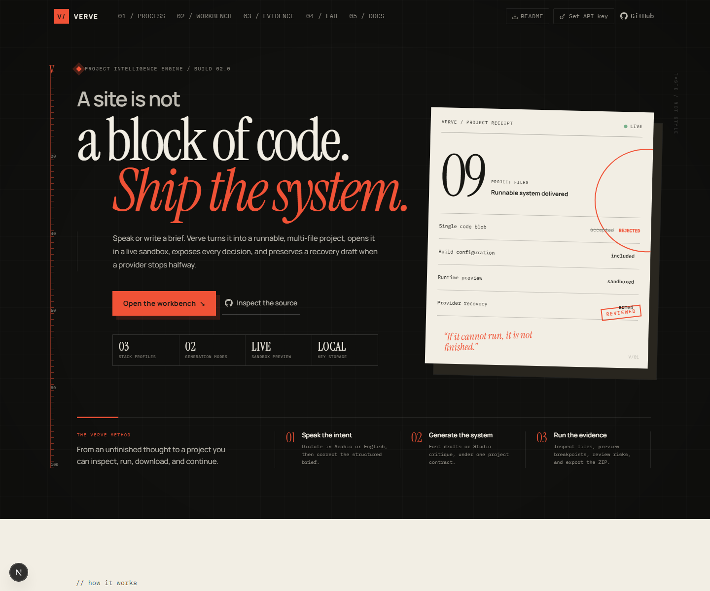

# Verve — speak a brief, ship a complete project



Verve is an open-source project intelligence engine for generating distinctive web projects from spoken or written briefs. It does not stop at a code block: every successful run returns a runnable multi-file project, design rationale, validation evidence, and a ZIP export. HTML and React projects also open in a lightweight live sandbox; complete Next.js projects use an inspect-and-export workspace for reliable local execution.

[Development preview](https://verve-dev.vercel.app/) · [Architecture](docs/ARCHITECTURE.md) · [Roadmap](docs/ROADMAP.md) · [MIT License](LICENSE)

## Verve Creative Engine v3 (beta)

- **Six-direction board** — every new run explores two combinational, two exploratory, and two transformational directions before code. Auto-selection applies a quality floor, then maximizes distance from recent Verve structures, then brief fit; statistical likelihood is never a reward.
- **Executable ProjectSpec v2** — the chosen direction compiles into bounded routes, nested regions, interaction states, responsive compositions, visual depth, media policy, invariants, and file budgets before code generation.
- **Fixation-resistant references** — `data/reference-library.json` defines a 12-domain × 6-experience matrix (72 abstract patterns). Retrieval supplies one near principle, two remote analogies, and one anti-reference without passing source palettes or brand identities to the model.
- **Private local design memory** — the browser keeps only bounded structural and numeric DOM fingerprints, including a 12×12 occupancy grid, type distribution, color histogram, media/interaction density, section rhythm, and route count. Briefs, code, images, and API keys are never stored in this memory.
- **Inspectable Stage Graph** — deterministic post-plan work now runs as immutable, independently testable experience-contract and direction-diversity stages.
- **Three-viewport render evidence** — HTML and React readiness cannot pass from one convenient preview. Render Gate retains separate evidence at 360, 768, and 1440 pixels and triggers one bounded Creative retry when the delivered structure repeats Verve's house composition.
- **Task-bearing openings** — ProjectSpec allows compact, split, or viewport-filling openings. [First Viewport Effectiveness](docs/FIRST_VIEWPORT_EFFECTIVENESS.md) measures visible task signals, information salience, primary-action clarity, and scroll cost; opening size itself is never rewarded or penalized.
- **Fast stays fast** — one board call plus one code call. Creative normally spends five calls and is bounded at seven when a plan revision, code repair, or one diversity retry is needed.

### Research rationale

Creative Engine v3 adapts established ideas rather than treating one numeric score as proof of creativity. The separate board and expansion phases are informed by the generative/exploratory distinction in [Creative Cognition](https://mitpress.mit.edu/9780262560962/creative-cognition/). Reference retrieval deliberately mixes near and remote principles because early examples can stimulate ideation but can also create design fixation, as reported by [Jansson and Smith](https://doi.org/10.1016/0142-694X(91)90003-F) and [Perttula and Sipilä](https://doi.org/10.1080/09544820600679679). Direction operators are structured variation prompts informed by the empirical [77 Design Heuristics](https://doi.org/10.1016/j.destud.2016.05.001).

The selector is a small product-specific adaptation of [MAP-Elites](https://arxiv.org/abs/1504.04909) and [quality-diversity search](https://doi.org/10.3389/frobt.2016.00040): it keeps quality as a gate while comparing candidates across explicit behavioral descriptors. It is not a full evolutionary optimizer. Archive distance borrows the anti-convergence motivation of [novelty search](https://doi.org/10.1162/EVCO_a_00025). Norman's visceral, behavioral, and reflective levels from [Emotional Design](https://www.hachettebookgroup.com/titles/don-norman/emotional-design/9780465004171/) remain a descriptive review lens, never a creativity score.

## What changed in 0.8 Simplified Product Flow

- **Four clear destinations** — the global navigation is now Create, Examples, Editor, and Docs; provider keys and GitHub remain utilities rather than competing product steps.
- **Focused creation** — `/create` opens directly on the brief. Fast remains the default, while provider, framework, Creative, brand, and media controls use progressive disclosure.
- **One examples system** — `/examples` contains six runnable, structurally separated results. Each result owns the first viewport; brief, decisions, diversity evidence, references, assets, and tests live in a neutral receipt drawer.
- **Editor as the continuation** — `/editor` starts with an intentional empty state and separates Preview, Code, AI, Checks, and Project actions. AI changes remain staged until explicit acceptance.
- **Backward-compatible routes** — `/demos` and `/showcase` redirect to `/examples`; existing bookmarks continue to work without preserving duplicated interfaces.
- **No forced onboarding** — the blocking first-visit modal was removed so the product teaches itself through labels, defaults, and contextual controls.

## What changed in 0.7 Live Project Studio

- **Dedicated project editor** — `/editor` opens generated or demo projects in a focused multi-file workspace with live HTML/React preview and a complete Next.js source inspector.
- **Local-first persistence** — editable projects autosave to IndexedDB, remain available after reload, and support up to eight named local revisions per project.
- **Portable workspaces** — import and export `.verve.json` project records without an account or server-side project database.
- **Edit-safe delivery** — previews, validation, snapshots, and ZIP exports follow the canonical edited source; temporary render probes never leak into saved projects.
- **Stronger production gates** — placeholder forms and authored motion without a reduced-motion policy now block readiness; preview presets cover 360, 768, and 1440 pixels.
- **Supply-chain checks** — CI actions are commit-SHA pinned, with CodeQL, dependency review, Dependabot, and a quota-free load-smoke harness.

## What changed in 0.6 Brand Inputs + Diversity Gate

- **Owned brand kit** — supply an existing name, approved colors, identity constraints, logo, and up to four PNG/JPG/WebP/SVG assets before generation.
- **Private binary path** — image bytes stay in the browser session; the model receives only safe filenames, paths, roles, and user-authored alt direction. The original binary files are attached to preview and ZIP export after generation.
- **Framework-correct assets** — HTML uses `assets/*`; React and Next.js export the same media under `public/assets/*` and reference it through `/assets/*`.
- **Template Diversity Gate** — the recurring huge-sans + italic-serif + viewport-stage recipe now caps distinctiveness at 84 and forces a domain-native topology.
- **Different demo systems** — Reframe is a measured plan canvas, Maeda is a menu-first Arabic split, and Ledgerline is a dense operational interface. Visual briefs are honestly marked as requiring owned photography.
- **Laptop workbench** — at common laptop widths, the preview gets a full row and enough width to render a desktop result instead of a squeezed pseudo-mobile page.

## What changed in 0.5 Asset Assurance

- **Media Requirement Engine** — classifies imagery as required, recommended, optional, or avoidable from the actual brief before code generation.
- **Truthful Media Gate** — reports approved asset count and blocks production readiness when an image-dependent project lacks sufficient photography.
- **Context-sensitive sourcing** — restaurant, architecture, hospitality, skincare, fashion, real-estate, travel, and portfolio briefs require visual evidence; interface-led products can deliberately avoid stock photography.
- **Visible source state** — the workbench shows whether browser-local Pexels sourcing is connected before a run.

## What changed in 0.4.1 Separate Results

- **Separate no-key demo gallery** — `/demos` keeps architecture, Arabic hospitality, and carbon SaaS results away from the homepage while preserving complete file inspection, live validation, editing, and ZIP download.
- **Truthful route roles** — `/demos` contains runnable generated projects; `/showcase` remains the product evidence and methodology surface.
- **Mobile navigation** — a focused hamburger drawer consolidates routes, README, GitHub, and key management with keyboard-safe behavior.
- **Native HTML runtime** — HTML/CSS uses an isolated browser frame with zero package downloads; React remains on the lightweight Sandpack runtime.
- **Discoverable release surface** — canonical metadata, generated social cards, sitemap, robots policy, manifest, and SoftwareApplication structured data.
- **Public engineering contract** — CI, issue forms, changelog, security policy, and an explicit disclosure of the browser-local BYOK request path.
- **Shareable launch receipt** — every completed result can produce a 1200 × 630 PNG score card, a privacy-bounded share summary, and a direct Public Beta feedback path.

## What changed in 0.2

- **Project Engine** — assembles complete Next.js 16, React 19 + Vite, or standalone HTML projects.
- **Framework-safe preview** — HTML and lightweight React run in the live sandbox; Next.js projects use a file inspector and ZIP export instead of an incompatible browser shell.
- **Fast and Creative modes** — a two-model-call draft path with local brief extraction and a deeper adversarial production path (`studio` remains a request alias).
- **Voice briefs** — dictate in Arabic or English, review the transcript, then generate.
- **OpenRouter recovery** — gateway-managed model fallback, structured JSON output, local brief/plan resilience, ten-second SSE heartbeats, truncation detection, failed-stage reporting, and a downloadable recovery draft.
- **Resumable Fast checkpoints** — after contrast enforcement, a failed code call can resume from stage 05 without paying for another brief or plan call.
- **Complete ZIP export** — source, configuration, dependencies, `.gitignore`, and a project-specific README.
- **Production warnings** — flags fake forms, unsafe HTML injection, unsupported quantified claims, runtime asset dependencies, root-level mobile clipping, weak React keys, missing fonts, tiny text, and missing reduced-motion handling.
- **Project Validator 0.2.1** — verifies scaffold files, entry exports, relative imports, declared dependencies, fragment links, form contracts, image alternatives, button types, reduced motion, and unfinished content markers.
- **Live Problems + Console** — revalidates the edited project inside the workbench and surfaces Sandpack runtime failures beside deterministic checks.
- **Rendered-result gate** — HTML/React previews report real viewport overflow, console failures, tiny text, missing image alternatives, duplicate IDs, and unnamed buttons before readiness can become `ready`.
- **Browser smoke suite** — Playwright verifies desktop/mobile rendering, horizontal overflow, browser errors, security headers, and Verve's own 10px readable-type floor using the installed Chrome channel.
- **Edit-safe export** — ZIP packages the current editor state, not the original generated snapshot.
- **Calibrated Fast evidence 0.2.4** — Fast-mode structural evidence can no longer masquerade as an adversarial visual review, blocklist and usability failures cap the final grade, cliché matching requires distinctive evidence, and the plan prompt no longer recommends its own forbidden cream token.
- **Truthful scoring and HTML delivery 0.2.3** — adversarial design flags cap distinctiveness scores, engineering checks avoid reduced-motion and fluid-width false positives, static HTML projects ship accurate no-build instructions, and generators may not fabricate item-level portfolio records from a total count.
- **Provider resilience 0.2.2** — GPT-5.6 uses the Responses API, calls have stage-specific deadlines, Studio review degrades to a deterministic preflight, and a silent stream creates an immediate recovery checkpoint.
- **Local BYOK** — provider keys are stored in the current browser only and sent only with the request that uses them.

## Why Verve exists

Most AI interface generators optimize for the statistically safest answer. The result is usually a familiar hero, generic copy, interchangeable cards, and code that looks complete until someone tries to run or extend it.

Verve applies three independent contracts:

1. **Taste contract** — reject category clichés, form a coherent visual thesis, enforce restraint, and expose the reasoning.
2. **Project contract** — return real files, runtime configuration, dependency metadata, truthful interactions, validation warnings, and a runnable preview.
3. **Evidence contract** — never turn missing facts, media, runtime behavior, or a repeated Verve template into a high-confidence production claim.

Distinctiveness is not allowed to hide broken behavior. A high visual score and production readiness remain separate evidence. These gates materially reduce weak or hallucinated output; they do not make an LLM infallible or replace human review for legal claims, production data, security, or final art direction.

## Generation modes

| Mode | Model calls | Best for | Behavior |
|---|---:|---|---|
| **Fast (default)** | 2 core calls, plus gateway/schema fallback | OpenRouter free models, exploration, rapid drafts | Provider Direction Board, local selected-plan compilation, provider code, deterministic validation |
| **Creative** | 5 normally, 7 maximum | Direction choice, production candidates, and complex briefs | Two independent direction batches, selected-plan expansion, adversarial critique, code generation, and at most one repair or diversity retry |

Both modes return the same `GeneratedProject` schema, so the workbench, history, preview, API, and ZIP exporter do not need mode-specific output handling. Omitting `mode` selects Fast. `studio` remains a backwards-compatible request alias for Creative; new clients send `creative`.

Creative is an active beta in the UI. Set `NEXT_PUBLIC_CREATIVE_ENGINE_V3=false` for a Fast-only deployment while keeping the backwards-compatible API contract available.

## Supported project stacks

### Next.js 16 + React 19 + TypeScript

The primary stack. A generated project includes:

```text
app/
├── globals.css
├── layout.tsx
└── page.tsx
next.config.ts
next-env.d.ts
tsconfig.json
package.json
.gitignore
README.md
```

### React 19 + Vite + TypeScript

```text
src/
├── App.tsx
├── index.css
└── main.tsx
index.html
vite.config.ts
tsconfig.json
package.json
.gitignore
README.md
```

### Standalone HTML

A zero-build `index.html` plus a project-specific README. This is best for portable landing pages and quick prototypes.

## Pipeline architecture

```text
Spoken or written brief + optional owned brand kit
        ↓
[01] Brief analysis
        ↓
[02] Media requirement + owned/stock assets + cliché blocklist + competitive field
        ↓
[02.5] Archetype ───────── local in both modes
        ↓
[02.6] Motion language
        ↓
[03] Selected design plan ─ local compilation in Fast / provider expansion + critique in Creative
        ↓
[04] Deterministic contrast correction
        |
[04.1] VerveProjectSpec experience + task-bearing opening contract
        |
[04.2] Quality-diversity assessment + local novelty memory
        ↓
[05] Production-minded entry code
        ↓
[05.5] Syntax validation ─ deterministic in Fast / bounded repair in Creative
        ↓
[06] Distinctiveness + template diversity + first-viewport + engineering evidence
        ↓
[07] Project Engine → files + dependencies + scripts + README + warnings
        ↓
Live sandbox / ZIP / history
```

The adapter is request-scoped: no global provider instance and no server-side key persistence. Media requirements, asset sourcing, blocklist scanning, template-diversity detection, competitive analysis, contrast correction, engineering checks, project assembly, and final scoring are deterministic.

For a simpler mental model, the observable stages belong to four macro phases: **Understand** (brief/context), **Direct** (archetype/plan), **Build** (code/repair), and **Prove** (render, media, diversity, engineering, ZIP). The smaller modules remain separate because they fail differently and produce inspectable evidence—not because nine LLM agents are required.

Optional intelligence is fail-open: if adversarial review or its revision exceeds its call budget, Verve keeps the last valid plan, runs the local production preflight, and continues to code generation. Core generation failures still end in a visible recovery project.

## OpenRouter reliability

Free routed models can rate-limit, hang, return empty content, or stop at their output limit. OpenRouter documents this capacity for experimentation and low-volume use rather than guaranteed production traffic. Verve treats an incomplete answer as a provider failure rather than presenting half a project.

The OpenRouter path now provides:

- local Fast-mode brief extraction, saving one free request per run;
- a local brief-specific plan if provider planning fails;
- an input-bound local checkpoint that resumes code generation without repeating the plan call;
- gateway-managed fallback between the selected free endpoint and the free router;
- stage-specific deadlines up to a 90-second hard ceiling;
- strict JSON Schema output for brief and plan calls;
- `max_completion_tokens` with additional reasoning/output headroom;
- explicit `finish_reason: length` rejection;
- stage-aware retry telemetry;
- ten-second stream heartbeats;
- a terminal `stage_error` with the failed stage;
- a `recovery` event containing a safe, downloadable fallback project;
- client detection when a stream closes without `result` or `recovery`.

For free OpenRouter models, start with **Fast mode**. Creative remains available, but provider availability—not Verve—still controls free-model capacity.

## Local development

Requirements: Node.js 20+ and an API key from Anthropic, OpenAI, Google AI, or OpenRouter.

```bash
git clone https://github.com/Almotasembellahawwad/Verve.git
cd Verve
npm install
npm run dev
```

Open `http://localhost:3000`. Add a provider key from the key manager. It is saved under Verve’s browser-local storage namespace and is never written to the repository or a Verve database.

The optional canonical-site setting is documented in [`.env.example`](.env.example). Provider and Pexels keys are entered in the browser key manager and must not be added to environment files. Pexels is optional for using Verve, but approved media is not optional for a brief classified as image-dependent: without it Verve never invents remote URLs, exports honest labeled placeholders, and keeps readiness blocked until real assets are supplied. Only asset manifests and user-authored direction are sent with provider requests. Lightweight generation history omits binary content; projects explicitly opened in `/editor` persist their complete editable workspace in this browser's IndexedDB.

## Commands

```bash
npm run dev        # Next.js development server
npm run typecheck  # strict TypeScript validation
npm run lint       # ESLint
npm test           # deterministic engine tests
npm run build      # production build
npm start          # serve the production build
npm run test:load  # quota-free admission/health load smoke
```

## API

### `POST /api/generate`

```json
{
  "brief": "A bilingual architecture studio portfolio for Abu Dhabi clients.",
  "framework": "nextjs",
  "mode": "fast",
  "provider": "openrouter",
  "model": "openrouter/free",
  "apiKey": "sk-or-v1-..."
}
```

The response contains analysis, plan, critique, code checks, scores, and the complete project:

```json
{
  "mode": "fast",
  "project": {
    "schemaVersion": 1,
    "name": "abu-dhabi-architecture-studio",
    "framework": "nextjs",
    "entryFile": "app/page.tsx",
    "files": [
      {
        "path": "app/page.tsx",
        "content": "...",
        "language": "tsx",
        "role": "source"
      }
    ],
    "dependencies": {
      "next": "^16.3.1",
      "react": "^19.2.4"
    },
    "scripts": {
      "dev": "next dev",
      "build": "next build"
    },
    "warnings": [],
    "readiness": { "status": "ready", "score": 100 }
  }
}
```

### `POST /api/generate/stream`

The workbench uses the SSE endpoint. Expected event flow:

```text
connected
stage_start
heartbeat       # every 10 seconds during a silent provider call
stage_retry     # when OpenRouter retries or switches model
stage_degraded  # optional Creative intelligence moved to local fallback
checkpoint      # safe Fast-mode stage state; never contains an API key
stage_done
result          # successful terminal event
```

Failure terminal flow:

```text
stage_error     # safe error code + failed stage
recovery        # downloadable fallback GeneratedProject
```

Other public routes are documented in the in-app `/docs` page.

## Security model

- API keys remain in browser storage and are sent only to Verve’s same-origin API route for the selected request.
- Keys are never included in results, history entries, logs, generated files, or recovery projects.
- Logs redact common Anthropic, OpenAI, OpenRouter, Gemini, and bearer-token patterns.
- HTML and React previews run inside a Sandpack iframe rather than Verve’s own React tree. Next.js output is inspected and exported without starting a browser shell.
- Project edits are revalidated in the browser and the exact edited files are used for ZIP export.
- Remote critique URLs must be public HTTPS targets; private-network and loopback addresses are rejected.
- Voice input requires an explicit browser microphone permission and remains editable before submission.
- Generated code is untrusted output. Review warnings and run the production build before deployment.

## Repository map

```text
app/
├── api/generate/              # JSON endpoint
├── api/generate/stream/       # SSE + heartbeat + recovery
├── docs/                      # in-product developer reference
└── page.tsx                   # product experience
components/
├── GeneratePanel.tsx          # orchestration workbench
├── ProjectWorkbench.tsx       # sandbox, files, responsive preview, ZIP
└── VoiceBriefInput.tsx        # Arabic/English speech input
lib/
├── application/
│   ├── run-generation-use-case.ts # request-independent orchestration
│   ├── generation-strategy.ts     # Fast/Creative policy
│   └── circuit-breaker.ts         # external-failure policy
├── domain/                         # dependency-free business rules
├── ports/                          # LLM, asset, repository, progress contracts
├── adapters/
│   ├── llm/                        # provider SDK implementations + factory
│   ├── rate-limit/                 # Upstash and local development stores
│   └── storage/                    # repository implementations
├── engine/                         # legacy generation/domain services
│   └── pipeline.ts                 # compatibility re-export facade
├── project/
│   ├── types.ts               # GeneratedProject contract
│   ├── project-builder.ts     # complete stack scaffolds + risk scan
│   ├── project-validator.ts   # multi-file production contract
│   └── editor-project.ts      # editor state → validation/export project
└── client/
    ├── key-storage.ts         # browser-local BYOK storage
    └── generation-stream.ts   # missed-heartbeat watchdog
tests/
└── engine.test.ts              # behavior + dependency-boundary checks
```

## Product principles

- A project that cannot run is not finished.
- A feature must not pretend to work.
- A recovery result is better than a silent spinner.
- Distinctive does not mean decorated.
- Fast and Creative may spend different compute, but must honor the same delivery contract.
- Generated facts must come from the brief or be labeled as placeholders.

## Contributing

See [Contributing](docs/CONTRIBUTING.md). The highest-leverage contributions are production-quality checks, stack templates, provider resilience tests, accessible preview behavior, and evidence-backed additions to the public cliché blocklist.

Please run:

```bash
npm run typecheck
npm run lint
npm test
npm run build
```

## License

[MIT](LICENSE) © Almotasembellah Awwad
